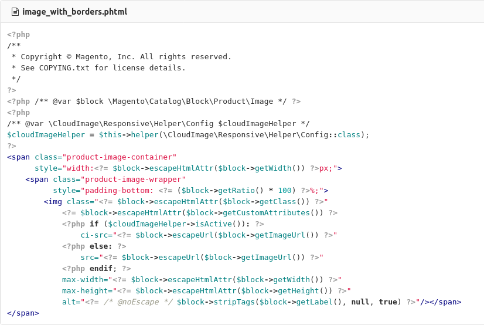

# Cloudimage Responsive Images module for Magento 2

## Introduction

Cloudimage is a scalable image CDN and proxy for transforming and optimizing images on-the-fly and accelerating them via rocket-fast Content Delivery Networks all around the world. 

The [Cloudimage Responsive Images Plugin](https://scaleflex.github.io/js-cloudimage-responsive) is a JS plugin for implementing Cloudimage in your code automatically and enabling responsive images on any web or mobile application. 

This Mangeto 2 module implements the Cloudimage Responsive Images Plugin on Magento 2 shops and accelerate your shop's landing page, category and product pages. 

There are 2 steps for enabling the plugin on your Magento 2 shop:
1. Install the plugin and perform the base configuration
2. Adapt the Magento templates to enable Cloudimage


## Install Cloudimage Responsive module for Magento 2

### Prerequisites

Cloudimage supports Magento Open Source and Commerce Edition from version 2 onwards.

To use the module, please sign up for a free account with [Cloudimage](https://www.cloudimage.io/en/registration) and get your Cloudimage token.
This token is required to configure the Magento plugin.

If you have a question or need assistance, feel free to contact our [support](https://www.cloudimage.io/en/contact-us).

### Install module by Composer

To be able to install the module by Composer, you need to get a copy of the module on the Magento Marketplace, or directly from Github.
 

```shell
composer config repositories.cloudimage vcs https://github.com/scaleflex/magento-cloudimage-responsive
composer require cloudimage/module-responsive-plugin --sort-packages
```

Enable and install following modules in Magento:

```shell
php bin/magento module:enable CloudImage_Responsive
php bin/magento setup:upgrade
```

### Configuration

Once the steps listed above are completed enter your Cloudimage token into the CloudImage Responsive module configuration the Magento admin interface:

```
Stores > Configuration > CloudImage By Scaleflex > CloudImage Responsive
```


Expand the `General` section and activate the module by selecting `Yes` in the `CloudImage Responsive Active` dropdown. Enter your Cloudimage token and configure the Options.

After saving the configuration, you will be asked to flush your Magento cache.

## Options

Following options are available: 

**Use origin URL:** If enabled, the module will only add query parameters to the image source URL without prefixing it with `{token}.cloudimg.io`. This is required if you use a dedicated subdomain for delivering your images (media) in Magento. You will need to complete the steps for enabling a custom CNAME in Cloudimage documented here.

**Ignore Image Size Node:** useful for improving compatibility with some themes.

**Ignore Image Size Style:** useful for improving compatibility with some themes.

**Lazy Loading:** if enabled, images will be lazy-loaded for better loading times and user experience.

## Advanced Configuration

This section is reserved for advanded user only!

Depending the template you have, it will be useful to customize the way Cloudimage get DOM information around your media files.

**Inject Custom JS function:** If enabled, you will be able to customize the js function used dynamically to get the DOM information.

**Custom js function:** The js function to customize Cloudimage library.

## Template Integration

In order to identify the media files Cloudimage will optimize, it is necessary to adapt your media template files.

The operation is simple. You need to replace DOM image element source "src" by a "ci-src". 

Like this: `` element by ``.

### Example

For example, with Magento_Catalog Product image template : `product/image_with_borders.phtml`

1. Copy Magento original template in your theme : `app/design/frontend/<your-theme>/default/Magento_Catalog/templates/product/image_with_borders.phtml`

2. Replace the src line `src="<?= $block->(...)"` 
by `ci-src="<?= $block->(...)"`

Here is an example using Cloudimage helper to modify the image element only if the Responsive plugin is activated:

Template : `app/design/frontend/<your-theme>/default/Magento_Catalog/templates/product/image_with_borders.phtml`


