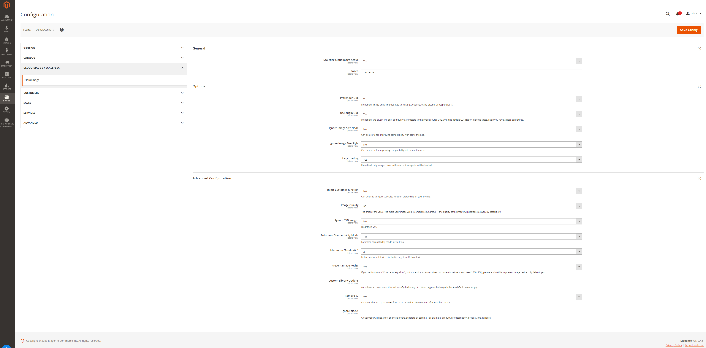

# Scaleflex Cloudimage responsive module for Magento 2

## Introduction

Cloudimage is a scalable image CDN and proxy for transforming and optimizing images on-the-fly and accelerating them via rocket-fast Content Delivery Networks all around the world.

The [Scaleflex Cloudimage Images Plugin](https://scaleflex.github.io/js-cloudimage-responsive) is a JS plugin for implementing Cloudimage in your code automatically and enabling responsive images on any web or mobile application. 

This Magento 2 module implements the Scaleflex Cloudimage Images Plugin on Magento 2 shops and accelerates your shop's landing page, category and product pages. 

There are 2 steps for enabling the plugin on your Magento 2 shop:
1. Install Scaleflex Cloudimage module for Magento 2
2. Adapt the Magento templates to enable Cloudimage (on-the-fly or manually)

### Warning

This version integrate changes in the Module's name and we therefore recommend a complete un-installation and re-installation to avoid any issue with your website if you are currently using a version below 1.1.0
Below the step by step guide to perform a smooth update:
1. Remove the Scaleflex Cloudimage plugin from the package
2. Remove all manual templates integration and all module references
3. Once the package is modified, deploy it
4. Remove the Cloudimage module row in the setup_module table with the following SQL request: ``` DELETE FROM setup_module WHERE module = 'CloudImage_Responsive' ```
5. Install this latest version in the package (standard new installation as described below)
6. Make all tests required
7. Once the package is ready, deploy it

It will briefly stop optimizing images through Cloudimage, but no broken image will be visible as a result of the update.
You also can skip the steps 1 to 3 in order to perform a faster update, but the images will be broken until the new version is fully deployed.

## 1. Install Scaleflex Cloudimage module for Magento 2

### Prerequisites

Cloudimage supports Magento Open Source and Commerce Edition from version 2 onwards.

To use the module, please sign up for a free account with [Cloudimage](https://www.cloudimage.io/en/registration?utm_source=magento-plugin&utm_medium=website&utm_campaign=magento-campaign) and get your Cloudimage token.
This token is required to configure the Magento plugin.

If you have a question or need assistance, feel free to contact our [support](https://www.cloudimage.io/en/contact-us).

### Install module by Composer

To be able to install the module by Composer, you need to get a copy of the module on the Magento Marketplace, or directly from Github.
 

```shell
composer config repositories.cloudimage vcs https://github.co
m/scaleflex/magento-cloudimage-responsive
composer require scaleflex/module-cloudimage
```

Enable and install following modules in Magento:

```shell
php bin/magento module:enable Scaleflex_Cloudimage
php bin/magento setup:upgrade
```

### Configuration

Once the steps listed above are completed enter your Cloudimage token into the Scaleflex Cloudimage module configuration the Magento admin interface:

```
Stores > Configuration > Cloudimage By Scaleflex > Cloudimage
```



Expand the `General` section and activate the module by selecting `Yes` in the `Scaleflex Cloudimage Active` dropdown. Enter your Cloudimage token and configure the Options.

After saving the configuration, you will be asked to flush your Magento cache.

## Options

**Support multiple websites and store views, now you can have difference token for each website.**

Following options are available: 

**Prerender URL:** If enabled, image url will be updated to {token}.cloudimg.io and disable CI Responsive JS.

**Use origin URL:** If enabled, the module will only add query parameters to the image source URL without prefixing it with `{token}.cloudimg.io`. This is required if you use a dedicated subdomain for delivering your images (media) in Magento. You will need to complete the steps for enabling a custom CNAME in Cloudimage documented here.

**Ignore Image Size Node:** useful for improving compatibility with some themes.

**Ignore Image Size Style:** useful for improving compatibility with some themes.

**Lazy Loading:** if enabled, images will be lazy-loaded for better loading times and user experience.*

*lazy loading can have variable results on some websites as for the first rows of images loaded, therefore it is recommended to make use of an integrated new class provided: “lazy-off”. You can specify the "lazy-off" class either in the page builder through the back-office, or in the templates directly (eg. category page and product page).

## Advanced Configuration [Optional]

This setting is for advanced users only and allows to inject a custom JS function into the Magento templates in order to support some specific Magento templates. Feel free to contact us in order to get the custom JS function to inject to address issues with your specific template.

**Inject Custom JS function**: If enabled, you will be able to customize the JS function used dynamically to get the DOM information.

**Custom js function**: The js function to customize Cloudimage library.

**Image Quality**: Customizes the image quality, therefore compression -size- applied by default. (warning, a setting under 80 might have a potentially visible impact)

**Ignore SVG images**: If enabled, all SVG images will be skipped from acceleration as anyway vector images will not be compressed.

**Fotorama Compatibility Mode**: Fotorama compatibility mode, default no

**Maximum "Pixel ratio"**: List of supported device pixel ratios, default is 2, eg: 2 for Retina devices

**Prevent Image Resize**: If you set Maximum "Pixel ratio" equal to 2, but some of your assets does not have min retina size(at least 2560x960), please enable this to prevent image resized

**Custom Library Options**: Those optional parameters will be added to the request for each URL going through the Cloudimage acceleration infrastructure. It can allow you to force image formats, apply automatic transformations or watermarking, and might be used for troubleshooting purposes. (for advanced users only, please refer to the official [Cloudimage documentation here](https://docs/cloudimage.io) for the list of possible parameters)

**Remove v7**: Removes the "/v7" part in URL format. Activate for token created after October 20th 2021.

**Ignore blocks(New)**: Cloudimage will not affect on these blocks, separate by comma. For example: product.info.description, product.info.attribute.

## 2. Integration "on-the-fly" in Magento templates

The final step before enjoying responsive and fast images is to modify the PHP templates to replace `` element by ``.

Once activated, the Scaleflex Cloudimage module will replace "on the fly" your template's classic image tag elements. Specifically, all image tags detected with a src attribute will be replaced with a ci-src attribute and will therefore be processed through the Cloudimage infrastructure, allowing transformations and CDN caching.

### Compatibility

This functionality is 100% compatible with the Magento Luma theme.

### Templates customization

In case you are using customized templates and some of them would be built in Javascript, you will most probably have to do a manual integration (see below). It means that if some blocks are modified by a javascript after the DOM load, the "on-the-fly" functionnality will not anymore be able to integrate them automatically.

## 3. Manual integration in Magento templates (Magento server access required)

In the case of a personalized template, to be able to benefit from fast and responsive images you might need to modify the PHP templates, to replace the `` element by ``.

Any Magento template file (.phtml) injecting images in your Magento shop via an `` HTML attribute should be modified as shown below in order to deliver responsive images wih Cloudimage.

### Example

As an example, the Magento product catalog page template `image_with_borders.phtml` can be found under `product/` folder on your Magento server. 

1. Copy Magento original template in your theme: `app/design/frontend/<your-theme>/default/Magento_Catalog/templates/product/image_with_borders.phtml`

2. Replace the src line `src="<?= $block->(...)"` by `ci-src="<?= $block->(...)"`

Here is an example using Cloudimage helper to modify the image element only if the Responsive plugin is activated:

Template : `app/design/frontend/<your-theme>/default/Magento_Catalog/templates/product/image_with_borders.phtml`

```
<?php
/**
 * Copyright © Magento, Inc. All rights reserved.
 * See COPYING.txt for license details.
 */
?>

<?php
$cloudImageHelper = $this->helper(\Scaleflex\Cloudimage\Helper\Config::class);
?>

<span class="product-image-container" style="width:<?= $block->escapeHtmlAttr($block->getWidth()) ?>px;">
    <span class="product-image-wrapper" style="padding-bottom: <?= ($block->getRatio() * 100) ?>%;">
        escapeHtmlAttr($block->getClass()) ?>"
            <?= $block->escapeHtmlAttr($block->getCustomAttributes()) ?>
            
            <?php if ($cloudImageHelper->isActive()): ?>
                ci-src="<?= $block->escapeUrl($block->getImageUrl()) ?>"
            <?php else: ?>
                src="<?= $block->escapeUrl($block->getImageUrl()) ?>"
            <?php endif; ?>
            
            max-width="<?= $block->escapeHtmlAttr($block->getWidth()) ?>"
            max-height="<?= $block->escapeHtmlAttr($block->getHeight()) ?>"
            alt="<?= /* @noEscape */ $block->stripTags($block->getLabel(), null, true) ?>"
            />
     </span>
</span>
```

If you have any issue with the modification your template files, feel free to contact our [support](https://www.cloudimage.io/en/contact-us).
