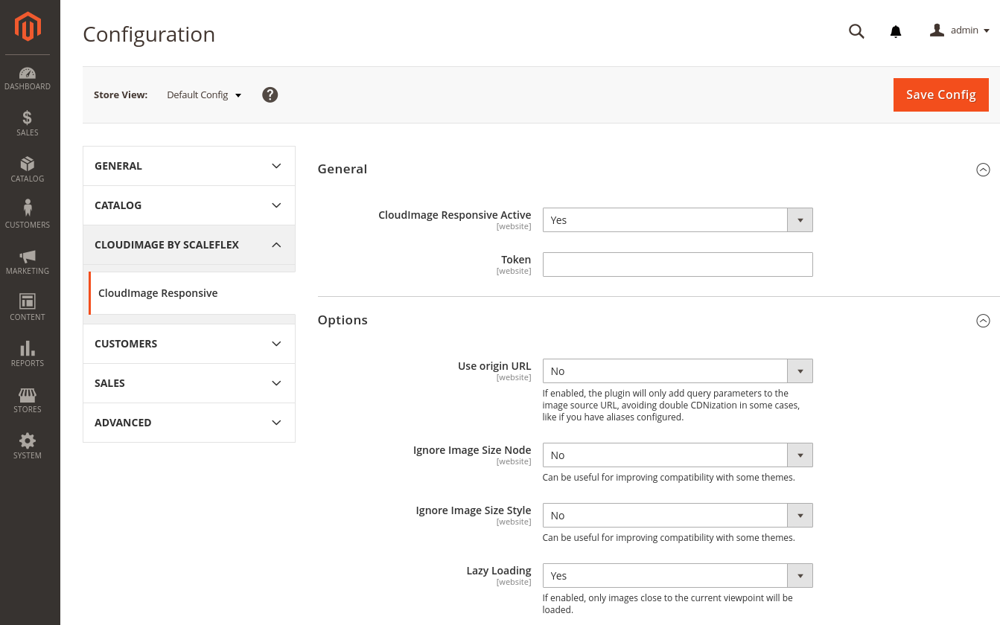

# Cloudimage Responsive Images module for Magento 2

## Introduction

Cloudimage is a scalable image CDN and proxy for transforming and optimizing images on-the-fly and accelerating them via rocket-fast Content Delivery Networks all around the world. 

The [Cloudimage Responsive Images Plugin](https://scaleflex.github.io/js-cloudimage-responsive) is a JS plugin for implementing Cloudimage in your code automatically and enabling responsive images on any web or mobile application. 

This Mangeto 2 mdoule implements the Cloudimage Responsive Images Plugin on Magento 2 shops.


## Install Cloudimage Responsive module for Magento 2

### Prerequisites

Cloudimage supports Magento Open Source and Commerce Edition from version 2 onwards.

To use the module, please sign up for a free account with [Cloudimage](https://www.cloudimage.io/en/registration) and get your Cloudimage token.
This token is required to configure the Magento plugin.

If you have a question or need assistance, feel free to contact our [support](https://www.cloudimage.io/en/contact-us).

### Install module by Composer

To be able to install the module by Composer, you need to get a copy of the module on the Magento Marketplace, or directly from Github.
 

```shell
composer require cloudimage/responsive --sort-packages
```

Enable and install following modules in Magento:

```shell
php bin/magento module:enable CloudImage_Responsive
php bin/magento setup:upgrade
```

### Configuration

Once the steps listed above are completed enter your Cloudimage token into the CloudImage Responsive module configuration the Magento admin interface:

```
Stores > Configuration > CloudImage By Scaleflex > CloudImage Responsive
```



Expand the 'General' section then select Yes in "CloudImage Responsive Active" dropdown.

Once you've selected Yes in the dropdown, the "API token" textbox will appear. Enter your token in it.

Click on "Save Button" and you will be asked to flush the cache.

## Features

The module allows you to activate/deactivate the following options:

**Use origin URL:** If enabled, the plugin will only add query parameters to the image source URL, avoiding double CDNization in some cases, like if you have aliases configured.

**Ignore Image Size Node:** Can be useful for improving compatibility with some themes.

**Ignore Image Size Style:** Can be useful for improving compatibility with some themes.

**Lazy Loading:** If enabled, only images close to the current viewpoint will be loaded.
